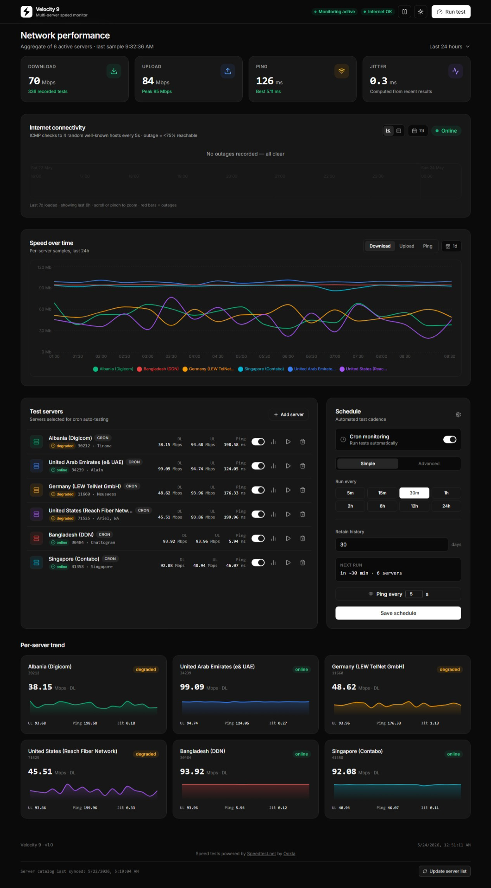

# Velocity 9

> *Velocity 9 - Vandal Savage's synthetic speed formula. Grants any ordinary person super-speed. Highly addictive. Totally worth it (Nah..).* - DC Comics / The Flash

Welcome to **Velocity 9**! 👋 This is a self-hosted network speed test dashboard powered by Ookla's [Speedtest.net](https://www.speedtest.net). If you've ever wanted to keep an eye on your long-term internet performance, track outages, or just run automated speed tests in the background, this is the tool for you.

You can set it up on pretty much anything that runs Node.js - whether that's a Linux box, a Mac, a Windows server, or even a Raspberry Pi (just make sure your Pi has Node 22 and an Ethernet port fast enough to handle your network speeds!).



## ⚠️ A quick heads-up on security

**Velocity 9 doesn't come with built-in authentication.** This means the dashboard and its API are wide open to anyone who can access port 3000 on your server.

**Please** don't expose this directly to the open internet! Keep it snug and safe on your private network, or stick it behind a VPN or reverse proxy (like Nginx with basic auth, Tailscale, or Cloudflare Access).

## What can it do?

- **Automated Speed Tests:** Set up a custom cron schedule to run tests quietly in the background.
- **Real-Time Testing UI:** Kick off a test manually and watch your download, upload, and ping stats update live.
- **Uptime Monitoring:** Pings a reliable host every few seconds to log any internet hiccups or full-blown outages.
- **Interactive Outage Timeline:** View your complete history of outages on a slick, zoomable 7-day timeline (it stores them indefinitely!).
- **Deep-Dive History:** Dig into your data with charts and tables covering 1-hour, 6-hour, 24-hour, 7-day, 30-day, or custom ranges.
- **Auto-Syncing Server Catalog:** Automatically pulls the public Speedtest.net server list every 7 days.
- **Bring Your Own Server:** Want to test against a specific Speedtest.net server? Just drop in its ID.
- **Dark & Light Modes:** Because we all have our preferences (saved right to your browser's `localStorage`).

## Under the Hood

Here's the tech that brings Velocity 9 to life:

| Layer | The Good Stuff |
|---|---|
| **Backend** | Node.js, Express, better-sqlite3, node-cron |
| **Frontend** | Alpine.js, Tailwind CSS, Vite |
| **Charts & Vis** | React, Recharts, vis-timeline |
| **Process Manager**| pm2 |
| **Speed Engine** | [speedtest-net](https://www.npmjs.com/package/speedtest-net) (Ookla) |

## What you'll need

- A machine running Linux, macOS, or Windows
- **Node.js 22+** (Don't worry, our setup script can install this via nvm for you)
- Build tools for compiling `better-sqlite3` (`build-essential` or `python3` - also handled by the setup script!)

## Getting Started (Production)

To get up and running on your server, simply run these commands:

```bash
git clone https://github.com/saaiful/velocity9
cd velocity9
chmod +x setup.sh && ./setup.sh
```

Here's exactly what `setup.sh` does behind the scenes:
1. Installs **nvm** (if you don't have it), then grabs and activates **Node 22**.
2. Installs necessary **build tools** for native modules.
3. Installs **pm2** globally to manage the app process.
4. Runs `npm install` and builds the frontend out (`npm run build`).
5. Starts the app via `pm2` and saves your process list.
6. Sets up `pm2` to launch on system boot automatically.

Once it's done, open your browser and head over to `http://<your-server-ip>:3000`.

> **💡 Note for the first run:** When Velocity 9 starts up for the very first time, it fetches the full catalog of Ookla speed-test servers to store in your database. Depending on your internet connection, this might take a minute or two. The dashboard will load right away, but if the server list looks empty at first, just hang tight - it'll populate shortly!

## Local Development

Want to tinker with the code? Awesome!

```bash
# Install all the dependencies
npm install
npm run dev
```

If you prefer to test the production build locally:
```bash
npm run build
npm start
```

## Tweak Your Settings

You can adjust your preferences directly in the **Settings** menu of the dashboard, or by making API calls. Everything is stored cleanly in the SQLite database.

| Setting | Default | What it does |
|---|---|---|
| `cron_schedule` | `0 */1 * * *` | Determines how often background scheduled tests run (standard cron format). |
| `ping_interval` | `5` | How often (in seconds) the connectivity monitor checks your connection (between 1 and 60). |

### Environment Variables

| Variable | Default | What it does |
|---|---|---|
| `PORT` | `3000` | The HTTP port your server will listen on. |
| `NODE_ENV` | `production` | Set this to `development` if you want verbose logging in your console. |

## The API

Feel like building your own frontend or integrating with another tool? All endpoints live under `/api`.

| Method | Path | Description |
|---|---|---|
| `GET` | `/api/dashboard` | Grab your overall aggregated dashboard info |
| `GET` | `/api/results` | Fetch paginated speed test results |
| `GET` | `/api/history/:host` | Get a specific server's history (supports query params: `?from=&to=&limit=`) |
| `GET` | `/api/servers` | See your list of monitored servers |
| `PUT` | `/api/servers` | Overwrite your monitored server list |
| `POST` | `/api/servers` | Add a new server to monitor by ID |
| `DELETE` | `/api/servers/:host` | Remove a server from monitoring |
| `GET` | `/api/servers/catalog` | Browse the complete Speedtest.net server catalog |
| `POST` | `/api/test/run` | Kick off a manual speed test |
| `GET` | `/api/test/progress` | (SSE stream) Watch live test progress |
| `GET` | `/api/ping/status` | Check if you're connected to the internet right now |
| `GET` | `/api/ping/outages` | Review recent outage records |
| `GET` | `/api/ping/stream` | (SSE stream) Listen for real-time connectivity changes |
| `GET` | `/api/settings` | Retrieve all your settings |
| `PUT` | `/api/settings` | Update `cron_schedule` and/or `ping_interval` |

## Project Structure

If you're exploring the codebase, here's where everything lives:

```text
├── server/
│   ├── server.js       # The main Express entry point
│   ├── speedtest.js    # Speed test runner & event emitter
│   ├── scheduler.js    # Handles those node-cron scheduled tests
│   ├── ping-monitor.js # Keeps an eye on your internet connectivity
│   ├── server-sync.js  # Syncs the massive Speedtest.net catalog
│   ├── db.js           # SQLite schema and all our query helpers
│   └── routes/
│       └── api.js      # Where all the API routes are defined
├── db/                 # Where your data lives (speed-test.db)
├── frontend/
│   ├── index.html      # Vite's HTML template
│   ├── main.js         # Bootstraps Alpine.js
│   ├── app.js          # The core Alpine component (UI state & methods)
│   ├── charts.js       # React & Recharts components doing their thing
│   ├── timeline.js     # vis-timeline for plotting outages
│   └── style.css       # Tailwind utility classes and overrides
├── public/             # Vite's final build output (served by Express)
├── iperf/win/          # Legacy iperf3 binaries (currently unused)
├── ecosystem.config.js # Config for pm2
└── setup.sh            # The magic one-shot production setup script
```

## Handy `pm2` Commands

```bash
pm2 status            # See all your running processes
pm2 logs velocity-9   # Follow the application logs in real-time
pm2 restart velocity-9
pm2 reload velocity-9 # Reload the app with zero downtime
```

## Credits

Massive shoutout to [Ookla](https://www.ookla.com) and their excellent [Speedtest CLI / API](https://www.speedtest.net/apps/cli) that powers `speedtest-net`.

Speed tests are powered by [Speedtest.net](https://www.speedtest.net) by [Ookla](https://www.ookla.com). Ookla trademarks are used under Ookla's [trademark guidelines](https://www.ookla.com/trademark-guidelines).

The name **Velocity 9** is a nod to DC Comics and *The Flash* - a legendary speed-enhancing formula that pushed speedsters beyond all known limits. Just like Barry Allen chasing the lightning, this app is always running.

## License

MIT
